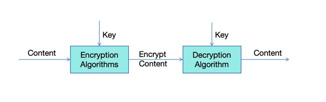
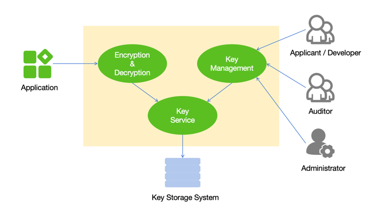
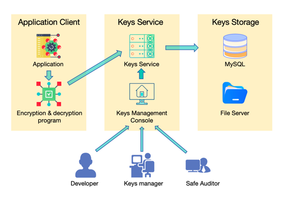

# AS-Security
## Modules Description
### as-key-console
Provides users with an entrance to manage keys
### as-key-service
Provides key and algorithm management and storage services
### as-security-framework
Provide system based framework services
### as-security-system
Provides system permission service and permission control
### as-security-api
Provide the encryption and decryption service entrance to the outside, and supply the call,
encrypt and decrypt the data through the algorithm

## Instructions
AS-Security is a service for encrypting/decrypting sensitive data. 
Such as usernames, mobile phone numbers, passwords, and even credit cards.
If these data are directly stored in the database, recorded in the log, 
or transmitted on the public network, once the data leaks, not only may 
produce significant economic losses, but also may make the company into 
a major public relations and legal crisis.

Therefore, sensitive information must be encrypted, that is, sensitive 
data in the form of ciphertext storage, transmission. In this way, 
even if the data is hacked and leaked, the stolen data is also ciphertext,
and the person who obtains the data cannot get the real plaintext content,
and sensitive data is still protected. When the application needs to access 
these ciphertexts, it only needs to decrypt the data to restore the original
plaintext data. Encryption and decryption process not only ensures the 
security of data, but also ensures the normal access of data.
The premise of all this is the security of the encryption and decryption process.

The system manages all encryption and decryption algorithms and keys in a unified manner.
The application only needs to call the interface for encryption and decryption, 
and the real algorithm and key are managed in the system server to ensure the security 
of the algorithm and key.

## Features
- Keys are managed in a unified manner and are not stored separately to ensure security
- The key fragment exchange mechanism meets the requirements of high-security key management and exchange
- Key version management supports flexible upgrade. Changing the key does not affect decryption of encrypted historical data
- The encryption and decryption algorithms are unified to ensure correct ciphertext resolution
- None of the users can see the complete key, and each person who manages the key can only see a fragment of the key. 
Both parties need to hand over the key to complete a key exchange

## User Case

- Application: use encryption and decryption services
- Developer: develop application
- Safety engineer: Audit algorithm and key security
- Key manager: A person who has direct access to the contents of a key when exchanging keys with a third-party system
- Key management system: A file system or database that stores key fragments

## Flow
1. The developer applies algorithms and keys for the application
2. Security engineers review the strength of algorithms and keys to meet security requirements
3. The key manager can view the key
4. The application program invokes the encryption and decryption function to encrypt and decrypt data
5. The encryption and decryption functions and key management functions invoke the key service functions to read and store keys
6. The key service function accesses the key storage system to read and write keys

## Structure

## Function
### User
Users log in to the platform and use the functions
### Role
A role associates operations and menus. Users can obtain menus and operation rights by associating with roles
### Algorithm classification
Classification of management algorithms
### Algorithm management
To manage different algorithms
### Key management
Fragment the keys and store them separately. Bind the keys to the applications' information, and support version recording
### Key Storage
The key is fragmented and stored separately in the database and file system
